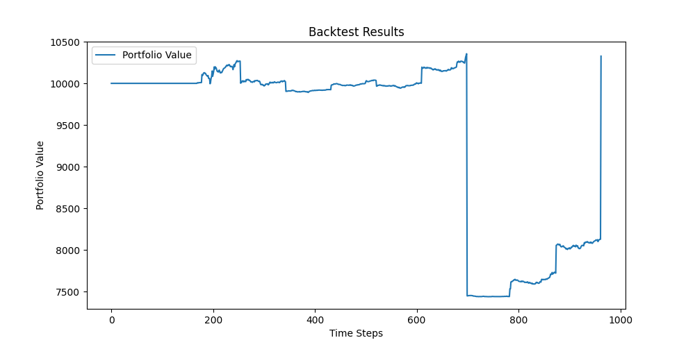

# Backtest Report
## Backtest Period: 2023-08-24 to 2023-12-29
## Portfolio Value Over Time

## Trades Executed
| Date | Symbol | Type | Shares | Price | Value | Tax Paid |
|------|--------|------|--------|-------|-------|----------|
| 2023-09-11 | NVDA | buy | 1 | $451.78 | $451.78 | $0.00 |
| 2023-09-19 | NVDA | buy | 1 | $435.20 | $435.20 | $0.00 |
| 2023-09-22 | NVDA | buy | 1 | $416.10 | $416.10 | $0.00 |
| 2023-09-25 | NVDA | buy | 1 | $422.22 | $422.22 | $0.00 |
| 2023-10-11 | NVDA | sell | 4 | $468.06 | $1813.56 | $58.68 |
| 2023-11-30 | NVDA | buy | 1 | $467.70 | $467.70 | $0.00 |
| 2023-12-04 | NVDA | buy | 1 | $455.10 | $455.10 | $0.00 |
| 2023-12-14 | MSFT | buy | 1 | $365.93 | $365.93 | $0.00 |
| 2023-12-18 | NVDA | sell | 2 | $500.77 | $972.31 | $29.23 |
| 2023-12-21 | RKLB | buy | 104 | $4.43 | $460.72 | $0.00 |
| 2023-12-22 | ULTA | buy | 5 | $471.36 | $2356.80 | $0.00 |
| 2023-12-26 | RKLB | sell | 104 | $5.64 | $546.29 | $40.27 |
## Current Holdings
| MSFT | 1 shares | Last known price: $376.04 |
| ULTA | 5 shares | Last known price: $489.99 |
## Summary Statistics
Initial Investment: $10000
Final Portfolio Value: $10326.61
Gross Profit/Loss: $326.61
Net Profit/Loss (after taxes): $198.43